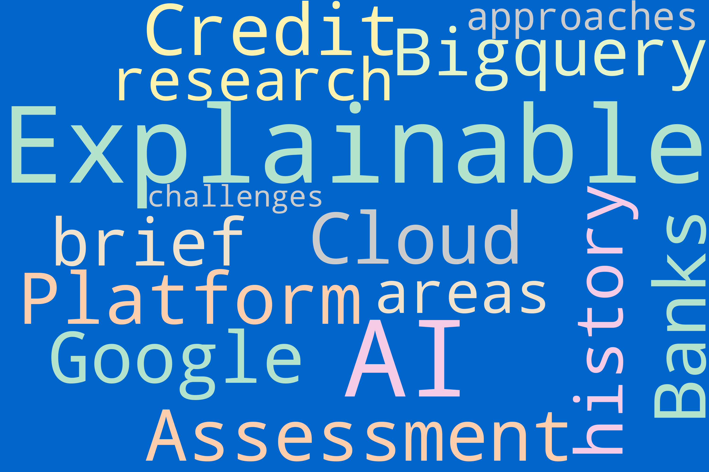
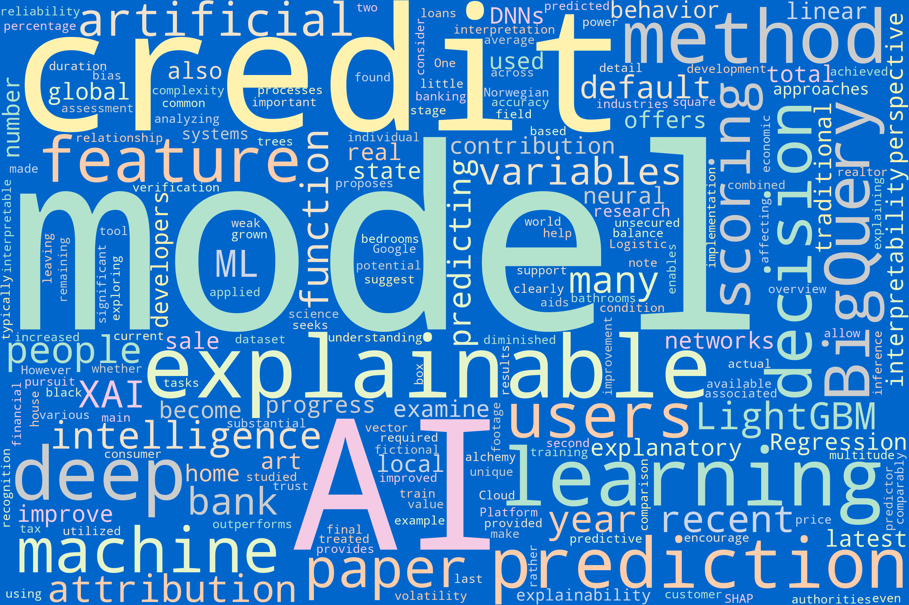
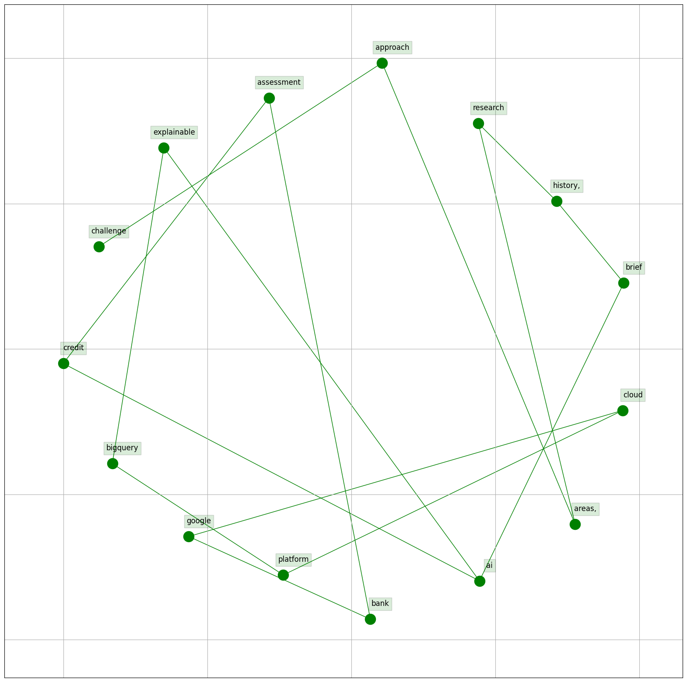
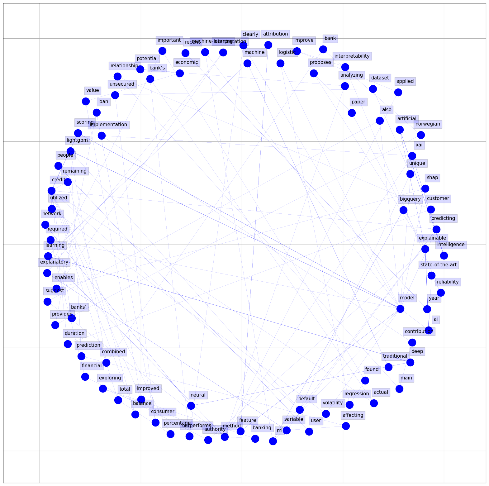

# Natural Language Processing Visualizations in Global reconstruction of language models with linguistic rules 
– Explainable AI for online consumer reviews Literature

## Woldcloud

### Title

<figure>
    
    <figcaption><strong>Figure 1:</strong> Title Word Cloud for the Literature</figcaption>
    
<em>Notes:</em> This word cloud represents the most frequently used words in the dataset fo Literare in XXX's titles. Larger words were used more often.

</figure>

### Abstract

## Bigram 

### Title

###  Abstract

