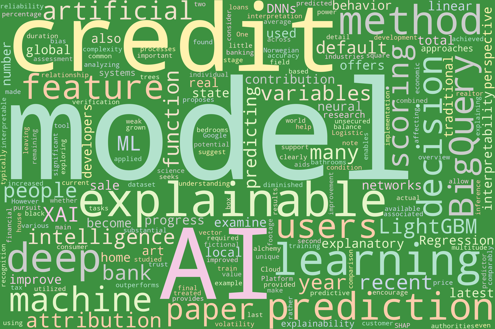
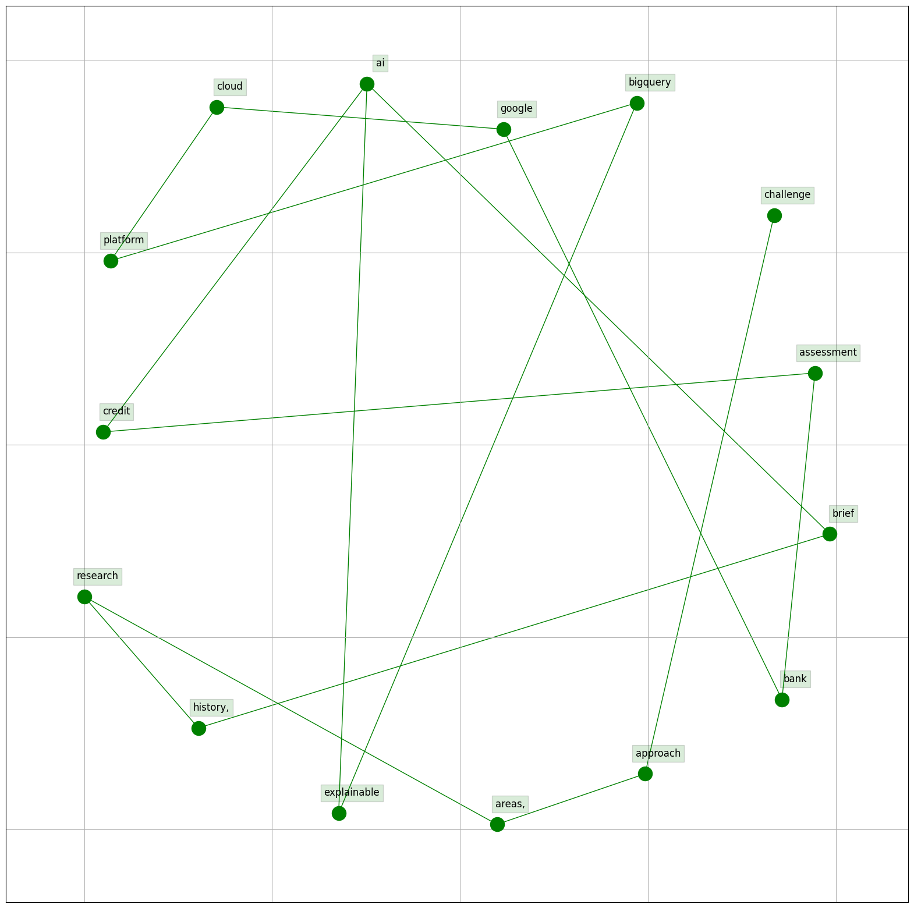
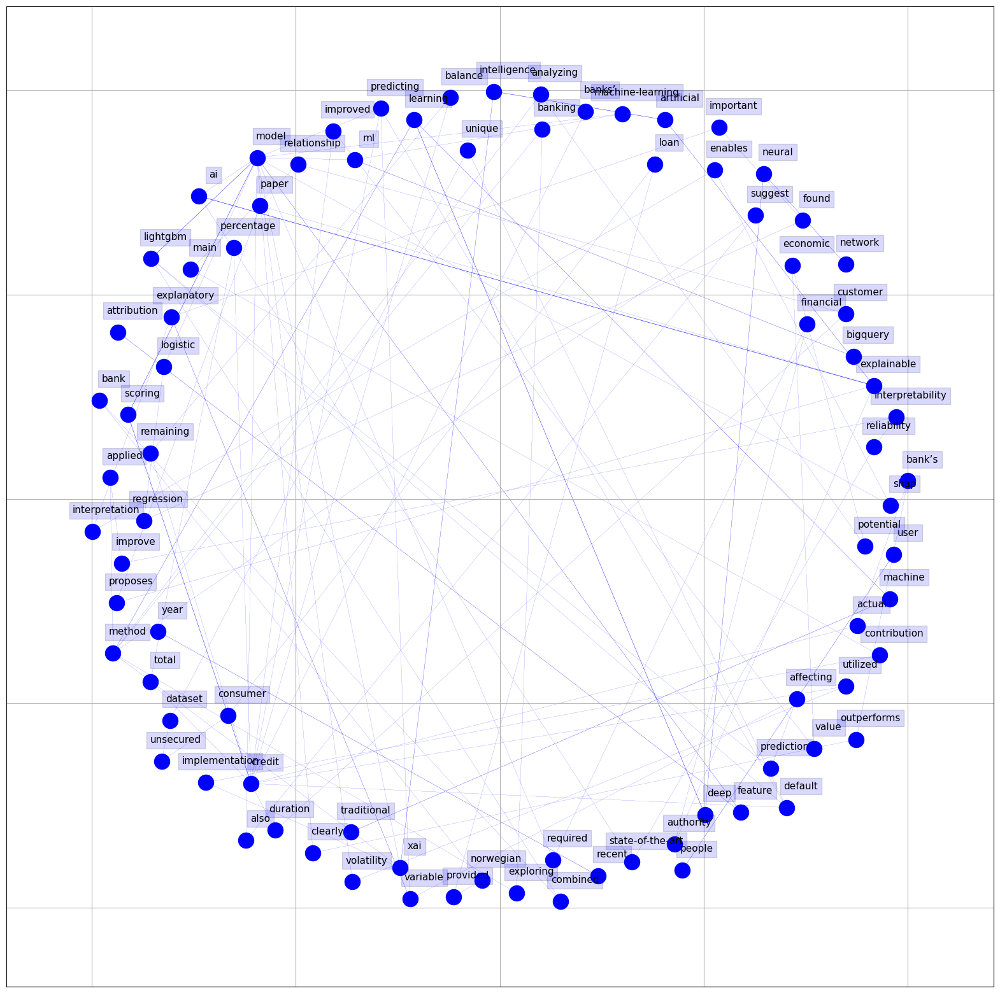

# Natural Language Processing Visualizations in XXX Literature

## Woldcloud

### Title

<figure>
    
    <figcaption><strong>Figure:</strong> Title Word Cloud</figcaption>
    
<em>Notes:</em> This word cloud represents the most frequently used words in the dataset's titles. Larger words were used more often.

</figure>

### Abstract

## Bigram 

### Title

###  Abstract

